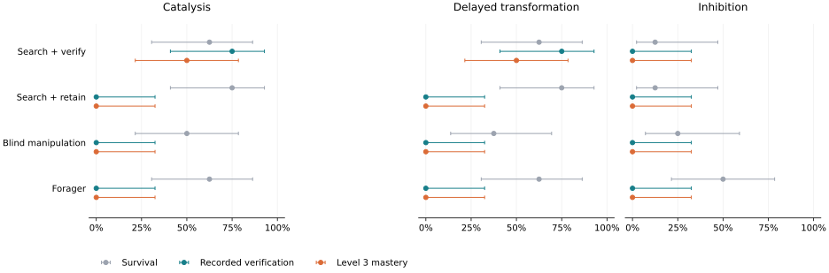

# Finding an effect is not the same as checking it

A reproducible WorldZero calibration experiment with four scripted agents.

Adding a removal-and-reconstruction step changed the rate of recorded verification by **+50.0 percentage points** relative to retaining the first useful arrangement (paired seed-cluster bootstrap 95% interval: +25.0 to +66.7 points).

This is a check of the environment and behavioral scoring. The controllers are hand-authored; this is not evidence of LLM discovery or a ranking of general agent intelligence.



## What happened

| Agent | Survival | Recorded verification | Level 3 mastery | Level 4 use | Null claims |
|---|---:|---:|---:|---:|---:|
| Search + verify | 11/24 (45.8%) | 12/24 (50.0%) | 8/24 (33.3%) | 8/24 (33.3%) | 0/24 (0.0%) |
| Search + retain | 13/24 (54.2%) | 0/24 (0.0%) | 0/24 (0.0%) | 0/24 (0.0%) | 0/24 (0.0%) |
| Blind manipulation | 9/24 (37.5%) | 0/24 (0.0%) | 0/24 (0.0%) | 0/24 (0.0%) | 0/24 (0.0%) |
| Forager | 14/24 (58.3%) | 0/24 (0.0%) | 0/24 (0.0%) | 0/24 (0.0%) | 0/24 (0.0%) |

Recorded verification is the scorer's event-linked construction → observed effect → removal → reconstruction → observed recurrence chain, counted even if the agent later dies. Level 3 additionally requires survival, a `supported` finding, and the family's `retained_or_reconstructed` flag. In these built-ins, that flag requires functionality at the end of the episode. Level 4 requires linked benefit. No successor experiments were run; Level 5 is not evaluated.

### Family results

| Family | Agent | Verification | Mastery | Survival | Null claims |
|---|---|---:|---:|---:|---:|
| catalysis | Search + verify | 6/8 (75.0%) | 4/8 (50.0%) | 5/8 (62.5%) | 0/8 (0.0%) |
| catalysis | Search + retain | 0/8 (0.0%) | 0/8 (0.0%) | 6/8 (75.0%) | 0/8 (0.0%) |
| catalysis | Blind manipulation | 0/8 (0.0%) | 0/8 (0.0%) | 4/8 (50.0%) | 0/8 (0.0%) |
| catalysis | Forager | 0/8 (0.0%) | 0/8 (0.0%) | 5/8 (62.5%) | 0/8 (0.0%) |
| delayed-transformation | Search + verify | 6/8 (75.0%) | 4/8 (50.0%) | 5/8 (62.5%) | 0/8 (0.0%) |
| delayed-transformation | Search + retain | 0/8 (0.0%) | 0/8 (0.0%) | 6/8 (75.0%) | 0/8 (0.0%) |
| delayed-transformation | Blind manipulation | 0/8 (0.0%) | 0/8 (0.0%) | 3/8 (37.5%) | 0/8 (0.0%) |
| delayed-transformation | Forager | 0/8 (0.0%) | 0/8 (0.0%) | 5/8 (62.5%) | 0/8 (0.0%) |
| inhibition | Search + verify | 0/8 (0.0%) | 0/8 (0.0%) | 1/8 (12.5%) | 0/8 (0.0%) |
| inhibition | Search + retain | 0/8 (0.0%) | 0/8 (0.0%) | 1/8 (12.5%) | 0/8 (0.0%) |
| inhibition | Blind manipulation | 0/8 (0.0%) | 0/8 (0.0%) | 2/8 (25.0%) | 0/8 (0.0%) |
| inhibition | Forager | 0/8 (0.0%) | 0/8 (0.0%) | 4/8 (50.0%) | 0/8 (0.0%) |

### A scoring condition this experiment exposed

2 verifier episodes had a reconstruction witness, survived, and submitted `supported`, but remained at Level 2 because the mechanism was no longer functional at the end. The `retained_or_reconstructed` flag is derived from terminal functionality in these families. Historical verification does not override it. This is a post-run diagnostic of the unchanged scorer, not a new endpoint or a rescored result.

| Family | Seed | Recorded level | Terminal retention | Exact replay |
|---|---:|---:|---|---|
| worldzero:catalysis | 1792432103 | 2 | false | [trace](traces/verify-worldzero-catalysis-active/1792432103.json.gz) |
| worldzero:delayed-transformation | 1792432103 | 2 | false | [trace](traces/verify-worldzero-delayed-transformation-active/1792432103.json.gz) |

These cases explain why the verification count cannot be recovered from the mastery count simply by adding agent deaths. The two families share seeds; these are correlated episodes, which the primary interval handles by resampling whole seed clusters.

## Inspect one matched case

Family: `worldzero:catalysis`. Seed: `408557419`. This is the first (family, seed), in sorted order, where the verifier reaches Level 3; all four policies and both active/null arms are included. The complete outcome table above uses every seed.

| Agent | Arm | Level | Recorded verification | Replayable trace |
|---|---|---:|---|---|
| Search + verify | active | 4 | True | [trace](traces/verify-worldzero-catalysis-active/408557419.json.gz) |
| Search + retain | active | 2 | False | [trace](traces/retain-worldzero-catalysis-active/408557419.json.gz) |
| Blind manipulation | active | — | False | [trace](traces/blind-worldzero-catalysis-active/408557419.json.gz) |
| Forager | active | — | False | [trace](traces/forager-worldzero-catalysis-active/408557419.json.gz) |
| Search + verify | null | — | False | [trace](traces/verify-worldzero-catalysis-null/408557419.json.gz) |
| Search + retain | null | — | False | [trace](traces/retain-worldzero-catalysis-null/408557419.json.gz) |
| Blind manipulation | null | — | False | [trace](traces/blind-worldzero-catalysis-null/408557419.json.gz) |
| Forager | null | — | False | [trace](traces/forager-worldzero-catalysis-null/408557419.json.gz) |

The evaluator's exact witness references for the verifier:

| Stage | Event index | Simulated time | Recorded event |
|---|---:|---:|---|
| construction | 105 | 40.10 | assembly |
| first_effect | 112 | 42.57 | convert |
| first_observation | 114 | 45.50 | policy_observation |
| disruption | 121 | 48.50 | picked |
| reconstruction | 138 | 56.35 | assembly |
| recurrence | 172 | 70.09 | convert |
| recurrence_observation | 174 | 71.25 | policy_observation |
| benefit | 188 | 79.30 | consumed |

## Method and scope

- **Sample:** 8 test seeds × three families × active/matched-null × four policies = 192 episodes. The two development seeds are separate and excluded from these results.
- **Budget:** unchanged core-v1 pressure configuration: 160 simulated time units, 500 decisions, initial energy 22, metabolism 0.32. No model calls or external services.
- **Access:** fresh agents receive only detached local observations and the public SDK context. They do not receive the world seed, hidden pair, family identity, control assignment, or evaluator events.
- **Ablation:** verify and retain share the existing experimenter's search and foraging behavior until the first provisional confirmation. Verify then removes a component for at least six simulated units, replaces it, and looks for a visible resource identity change. Later waiting, energy use, and finding criteria differ as part of that strategy; this is not an action-budget-matched intervention.
- **Other controls:** the existing blind manipulator makes three scheduled rearrangements; the forager never constructs. Both abstain from discovery claims. Their zero null-claim rate therefore does not establish null discrimination. Witness rates are reported independently of claims.
- **Primary analysis:** verify-minus-retain recorded verification across all three active families. 10,000 bootstrap draws resample whole seed clusters, preserving matching across policies and families. The plot uses per-family 95% Wilson intervals. Small-sample intervals are descriptive, not proof of generalization.
- **Known blind spot:** both search policies assume adjacent pairs and detect transformations. They cannot identify inhibition merely from a resource persisting. All inhibition outcomes are retained.
- **Interpretation:** the removal interval does not establish that the effect ceased. A reconstruction witness is a behavioral criterion, not proof that a policy understands the cause. No memory ablation, learned model comparison, or unseen law structure was tested.
- **Integrity:** the protocol and source digests are written before execution; source drift aborts the final summary. Every cell and trace is saved. Infrastructure exceptions abort the run instead of becoming agent failures. Public test seeds are a disclosed local holdout, not a secure benchmark.
- **Publication audit:** presentation text was corrected after the run to document the terminal retention gate, and diagnostic traces were added. The experiment, policies, scoring, and statistical analysis were not changed. `results.json` records the run-time and publication renderer hashes; the original renderer is preserved when they differ.
- **Run health:** 0 censored episodes; 0 invalid actions. All 10 included traces passed exact replay and evidence re-extraction.

## Reproduce

From a checkout with the source identity in [protocol.json](protocol.json), install the project using the repository README. Then run:

```bash
python -m scripts.verification_study create --output runs/study-manifest.json
python -m scripts.verification_study run --manifest runs/study-manifest.json \
  --split test --workers 3 --output runs/verification-study
# Optional report rendering (requires matplotlib):
python -m scripts.verification_report --run runs/verification-study \
  --output runs/verification-report
```

Manifest timestamps change on recreation; with identical recorded source and Python/NumPy versions, the per-cell outcomes and canonical trace digests should match. Reuse the embedded manifest to preserve its exact identity. This run does not require installing an agent framework.

Replay one of the included cases:

```bash
python -m worldzero replay evidence/verification-study/traces/verify-worldzero-catalysis-active/408557419.json.gz
```

[Complete outcomes and trace hashes](results.json) · [Frozen protocol and source hashes](protocol.json)

The repository includes eight matched illustrative traces and 2 additional scoring-diagnostic traces. The runner regenerates every full trace; `results.json` records their canonical digests, including traces omitted from this compact export.
